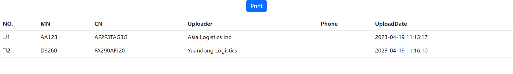

# Upload FIles
This file application built in Node.js, Express, Mongodb, Multer. This web application is used for Truck drivers to upload the photos of the container after  returning , thus the clerk of Asia Logistics are able to check and print the info and photos uploaded. 
<a href="http://asialogistics.info">Home page</a>
## Overview 
    
### Home/ Upload page 
This responsive page is for drivers to upload photos.

  

### Data list (for Asia Logistics Inc clerk)  
This  page is for Asialogistics clerk to view the data.

  

### Print page (for Asia Logistics Inc clerk)
This  page is for clerk to transfer needed info into PDF for the paperwork. 

  
